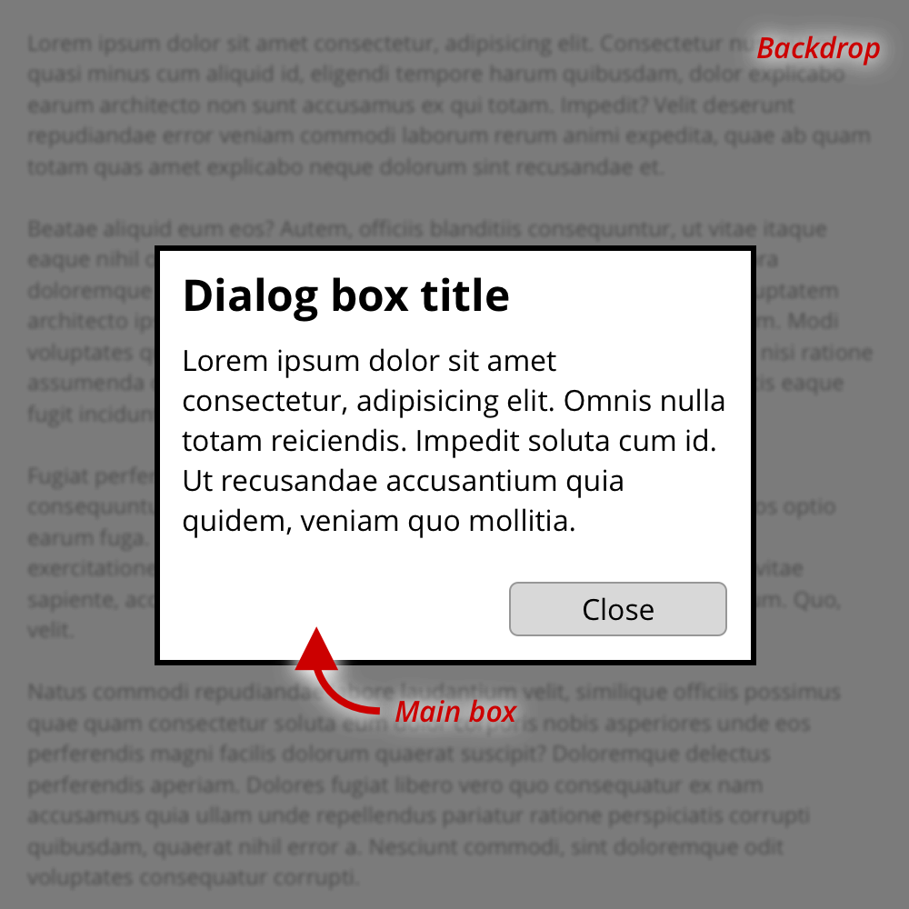

# Dialog box

A dialog box, aka Modal box or Pop-in, is a way to create a secondary workflow that interrupt the main page workflow. This secondary workflow must be completed (or aborted) before being able to resume the main workflow.

Because of their disruptiveness, dialog boxes must be used with care.

## Basic design



A dialog box is fundamentally defined by two things:

  1. A backdrop that hide more or less the content behind the dialog box;
  2. The dialog box itself;

Usually the backdrop is translucent and the dialog box is opaque but everything is possible. For example, it's possible to have no backdrop but a drop shadow behind the dialog box. Another example is when the dialog box cover the whole viewport (in that case, even if it is technically okay, it can be confusing for the user that could misunderstand the purpose of the UI)

The content of the dialog box if free but usually we have a title, a main content and at least one button to close the dialog (It can be either a button with an explicit label or a cross in the top-right corner, or sometimes in the top-left corner for <abbr title="Right-To-Left">RTL</abbr> languages)

## CSS

In our implementation we define two requirements:

`.dialog` which is the main container for our dialog box. We will use it to define the backdrop. `.dialog__main` is the container that materialize our visual dialog box.

```css
:root {
  /* We use CSS custom properties to ease customizing our dialog box.
     But you should simply overload the `.dialog`, `.dialog--open` and
     `.dialog__main` selectors in your own style sheet. */
  --dialog-backdrop: #CCCCCCCC; /* translucent grey */
  --dialog-background: white;   /* solid white */
}

.dialog {
  /* A dialog box must be position on top of the content and in the viewport,
     regardeless of the scroll position of the main page */
  position: fixed;
  z-index: 1;

  top: 0;
  left: 0;
  width: 100%;
  height: 100%;

  /* By default, a dialog box is not visible and
     should act as if it doesn't exist */
  display: none;

  /* This is how we materialise the backdrop */
  background: var(--dialog-backdrop);
}

/* Modifier that indicate that the modal is open */
.dialog--open {
  /* There are no hard rules here, but usualy the visual
     dialog box is centered in the viewport */
  display: flex;
  align-items: center;
  justify-content: center;
}

/* This is the visual dialog box */
.dialog__main {
  /* Everything is possible but at minimum,
     we expect a solid background color */
  background: var(--dialog-background);
}
```

## Special effects

Some effects (such as a blur on the backdrop or a smooth transition when the dialog display is changed) can require some extra CSS class to be done. As usual with CSS, feel free to be creative. The easiest way to deal with that is to use the JavaScript API to add an extra CSS class on the body to gain some opportunities.

```js
open(node).then(() => {
  // When this class is set, we are sure that the browser has performed
  // a reflow after the change of display state for the dialog box. This
  // is necessary to let us transition properties if we wish to.
  document.body.classList.add('dialogIsOpen')
})
```

```css
/* Example of a blur on the backdrop */
body.dialogIsOpen > :not(.dialog--open) {
  filter: blur(2px);
}

/* Example of a smooth effect on the visual dialog box */
.dialog__main {
  opacity: 0;
  transform: scale(.9);
  transition: all 500ms;
}

.dialogIsOpen .dialog--open > .dialog__main {
  opacity: 1;
  transform: scale(1);
}
```
